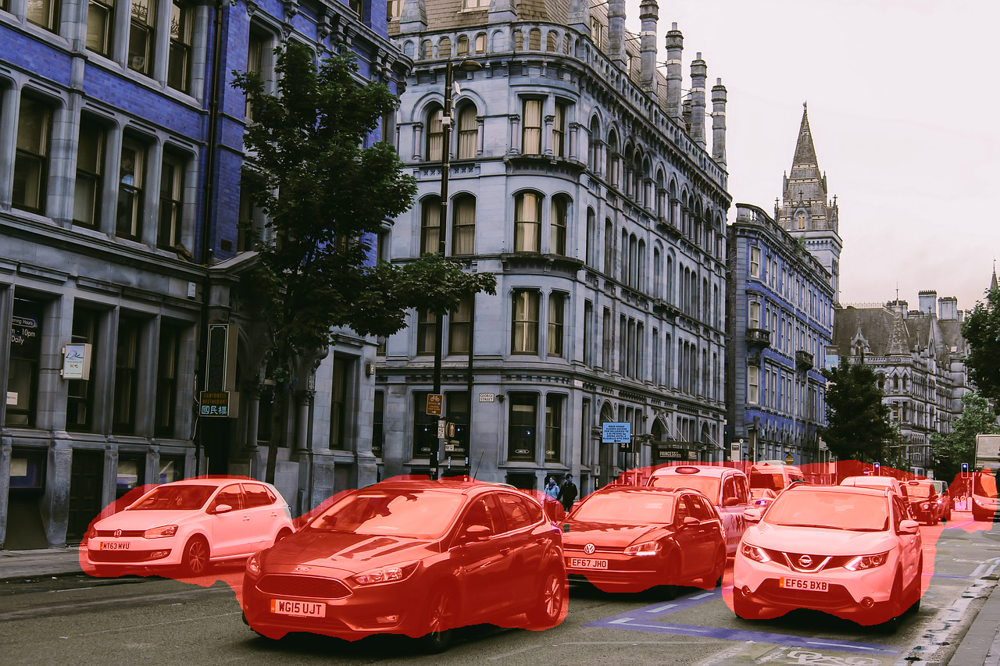

# Vehicle Segmentation with ResNet34 + UNet

This project performs semantic segmentation of vehicle classes using a ResNet34-based U-Net model. The model is trained on the Cityscapes dataset for binary segmentation of vehicle-related pixels.

<p align="center">
  
</p>

---
> 📂 Dataset: [Cityscapes Dataset](https://www.cityscapes-dataset.com/) was used for training.
---

## Project Structure

```
vehicle-segmentation-unet/
├── models/
│   └── resnet_unet.py              # ResNet-UNet model definition
├── weights/
│   └── model.pth                   # Trained model weights
├── data/
│   └── sample.jpg                  # Sample test image
├── output/
│   ├── mask.png                    # Binary prediction mask
│   └── overlay.png                 # Image with transparent segmentation overlay
├── predict.py                      # Main inference script
├── train_colab.ipynb              # Notebook used for training (on Colab)
├── README.md                       # Project documentation
└── requirements.txt                # Python package requirements
```

---

## Inference Example

```bash
python predict.py
```

This will:
- Predict vehicle masks on `data/sample.jpg`
- Save the binary mask to `output/mask.png`
- Save the overlay image to `output/overlay.png`

---

## Evaluation Metrics (ResNet34 + UNet on Cityscapes Vehicle Segmentation)

| Metric                   | Value   |
|--------------------------|---------|
| Final Loss               | 0.0348  |
| Mean Mask                | 0.0202  |
| Prediction Mean          | 0.0275  |
| Max Prediction           | 1.0000  |
| Min Prediction           | 0.0000  |
| Std Deviation            | 0.1568  |
| IOU (Intersection over Union) | 0.6619 |
| Dice Coefficient         | 0.7965  |

The model achieves **66.19% IOU** and **79.65% Dice score** after 50 epochs on the vehicle class segmentation task using the Cityscapes dataset.

---

## Installation

```bash
pip install -r requirements.txt
```

Required packages include:

- torch
- torchvision
- numpy
- opencv-python
- pillow
- matplotlib
